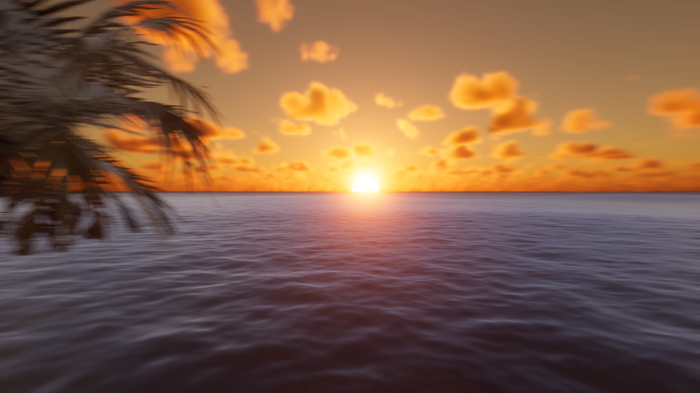
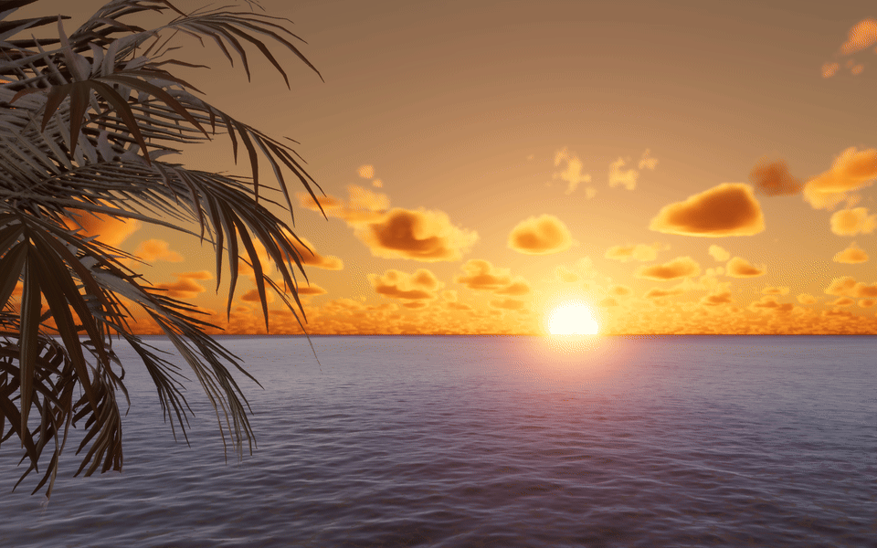

# BreathSea

**BreathSea** is the Unity program developed for the interactive installation **Upside-down World**.

**Upside-down World** is an in-person interactive artwork about memory, attention, and the unstable rhythm of the inner world. The audience sits inside a circular beach-like space, breathes toward a microphone, and watches a sunset ocean scene respond on screen. A soft breath keeps the sea calm. A stronger breath creates larger waves and can send a wave pulse forward across the water.

This repository contains the Unity project for the real-time ocean interaction.

## Exhibition at Shanghai Little Bridge School

This release preserves the fixed exhibition viewpoint and the real-time water
simulation. Microphone input is analysed continuously: quieter input keeps the
surface gentle, while stronger input increases the height, motion, and foam of
the waves. The images above were captured from the Windows Player build used
for this exhibition.

---

## Concept

In daily life, we receive large amounts of information before we have time to choose, filter, or understand it. Some of that information remains in the mind and slowly becomes part of memory.

**Upside-down World** turns this feeling into a quiet embodied experience. The beach setting creates a familiar space of rest and reflection, while the ocean becomes a metaphor for memories and thoughts: sometimes calm, sometimes overwhelming, and always moving.

Breathing becomes the connection between the body, the physical installation, and the digital sea. The work asks the audience to slow down, notice their own breath, and feel how a small bodily action can change the image in front of them.

---

## Interaction

1. The audience enters the circular beach space through the curtain opening.
2. They sit on the beach chair and look at the monitor.
3. The screen shows a calm sunset sea.
4. They breathe toward the microphone.
5. Soft breath keeps the sea calm.
6. Stronger breath makes the waves larger and more active.
7. A strong breath can trigger a traveling wave pulse from the near sea toward the horizon.
8. When the audience relaxes their breath, the ocean slowly returns to a calmer state.

---

## Requirements

Download the large file in `Release` page, put it under `\Assets\Scenes`

Recommended exhibition setup:

- A laptop or desktop with a GPU capable of running HDRP water, clouds, lighting, bloom, and high-resolution output
- A working microphone

## Runtime Controls

- Press `F8` to open or close the exhibition control panel. It shows the active
  microphone, live input level, and the calibration and wave-response settings.
- Use the panel to switch microphones and tune thresholds without rebuilding
  the project.
- Press `F9` to run the built-in simulated audio stress test when no microphone
  is available.

---

## Future Development

Possible future improvements include:

- More local wave variation across the sea surface
- Detection of breathing rhythm, inhale, and exhale patterns
- Weather or sky changes in response to stronger sound
- Emotion-based interaction using sound analysis or language models

---

## License and Third-Party Notices

BreathSea is an artwork and Unity-based interactive program developed for the installation **Upside-down World**.

This project is based on Unity Technologies' **WaterScenes** sample project:

https://github.com/Unity-Technologies/WaterScenes

The original WaterScenes license notice is preserved in `LICENCE.md`.

According to the original WaterScenes license notice:

- WaterScenes copyright © 2023 Unity Technologies.
- Source code from the WaterScenes package is licensed under the Unity Companion License.
- Other WaterScenes package content is licensed under the Unity Package Distribution License.
- Tree asset files and textures from the WaterScenes project fall under the SpeedTree Library EUA and are not for commercial use.
- The third person controller package is licensed under the Unity Companion License.

Original code and artistic additions made for **BreathSea / Upside-down World**, including the breath interaction logic, installation-specific scene adjustments, documentation, and exhibition concept, are © 2026 Minda Huang and collaborators, unless otherwise stated.

This repository is provided for documentation, educational, and exhibition purposes. It should not be assumed to grant commercial rights to Unity, WaterScenes, SpeedTree, or other third-party assets included in or derived from the original sample project.

For details, see `LICENCE.md` and the relevant Unity license terms.
